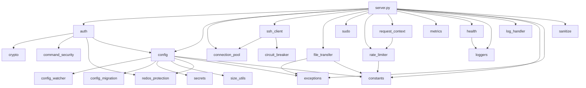

# AGENTS.md — AI Development Guide for mcp-ssh

**Contents:**
- [Project Overview](#project-overview) · [Project Layout](#project-layout) · [Plans & CI](#plans--ci)
- [Testing](#testing) · [Development Workflow](#development-workflow)
- [Coding Conventions](#coding-conventions) · [Definition of Done](#definition-of-done)
- [Dependency Management](#dependency-management) · [Docker / Deployment Notes](#docker--deployment-notes)
- [Security-Sensitive Areas](#security-sensitive-areas) · [Worked Example](#worked-example--adding-a-read-only-tool)

## Project Overview

**mcp-ssh** is a [Model Context Protocol](https://modelcontextprotocol.io/) server that exposes SSH command execution and SFTP file transfer as MCP tools. It runs as a Docker service behind a TLS reverse proxy (Traefik) and speaks streamable HTTP on port `8080` at `/mcp`.

**Stack:** Python 3.13, [FastMCP](https://gofastmcp.com/) 3.4.x, [paramiko](https://www.paramiko.org/) 5.0, Starlette 1.4, Prometheus client, watchdog

Five MCP tools (`ssh_list_servers`, `ssh_list_allowed_commands`, `ssh_execute_command`, `ssh_download_file`, `ssh_upload_file`) — see [README.md](README.md) for full documentation.

**Key architectural patterns:**
- Application-factory pattern — `create_app()` builds everything; zero I/O at import time
- Closure-based dependency injection for tool handlers (no module-level globals)
- Thread-pool executor for blocking paramiko SSH I/O
- Per-target SSH connection pooling with idle cleanup
- Layered authorization chain — see [Authorization Model](#authorization-model-critical-for-correctness) for the full layered chain
- Config hot-reload (15 s polling, 2 s debounce, watchdog where available)
- Circuit breaker + exponential-backoff retry for transient SSH failures
- Sliding-window rate limiter per client IP; `/health` exempt
- JSONL structured logging with rotation, gzip, and truncation

## Project Layout

```
mcp-ssh/
├── server.py                  # FastMCP app factory + CLI entry point
├── lib/                       # 24 modules (plus __init__.py re-exports)
│   ├── __init__.py            # Public re-exports
│   ├── auth.py                # AuthorizationManager, layered allow-list chain
│   ├── circuit_breaker.py     # Per-target failure threshold + recovery timeout
│   ├── command_security.py    # Command segmentation, dangerous-pattern detection, redirector stripping
│   ├── config.py              # ConfigManager — JSON load/validate/hot-reload
│   ├── config_migration.py    # Config schema migration (v1→v2, .bak backup, in-place rewrite)
│   ├── config_watcher.py      # Filesystem watcher (polling or watchdog)
│   ├── connection_pool.py     # Per-target SSH connection pooling
│   ├── constants.py           # ALL magic numbers, strings, defaults (single source of truth)
│   ├── crypto.py              # PBKDF2-HMAC-SHA256 API-key hashing + constant-time verify
│   ├── exceptions.py          # MCPSSHError hierarchy (base → specialised)
│   ├── file_transfer.py       # SFTP download/upload with 7-layer path validation
│   ├── health.py              # GET /health endpoint
│   ├── log_handler.py         # JSONLHandler — bridges stdlib logging → FileLogger
│   ├── loggers.py             # FileLogger (JSONL rotation/truncation/gzip)
│   ├── metrics.py             # Prometheus metrics + GET /metrics endpoint
│   ├── rate_limiter.py        # Sliding-window per-IP rate limiter
│   ├── redos_protection.py    # Safe regex compilation and ReDoS-resistant matching
│   ├── request_context.py     # Starlette middleware for request_id, client IP, API key
│   ├── sanitize.py            # Input sanitization helpers (sanitize_command, sanitize_target_name, sanitize_log_string)
│   ├── secrets.py             # SecretsManager for secrets.json + MCP_SSH_SECRET_* env var merging
│   ├── size_utils.py          # parse_size_bytes() for size-string settings (e.g. max_output_length)
│   ├── ssh_client.py          # SSHClientManager — connect, retry, circuit-break, pool
│   ├── sudo.py                # SudoHandler — validate, wrap sudo command, password injection
│   └── types.py               # TypedDict models for tool results
├── tests/
│   ├── test_*.py              # 29 unit-test files (24 covering lib modules, plus server/e2e/concurrency/schema/piping-chaining)
│   └── integration/
│       └── test_integration.py # Real Docker containers: SSH server + MCP server
├── docs/
│   └── SECURITY.md            # Full security model and hardening guide
├── Dockerfile                 # Multi-stage: SBOM → runtime (non-root, hash-pinned)
├── compose.yaml               # Docker Compose with Traefik labels
├── Makefile                   # build, up, down, test, integrationtest, clean-test
├── requirements.in            # Direct deps (pip-compile input)
├── requirements.txt           # Hash-locked transitive deps (pip-compile output)
├── requirements-build.in      # SBOM/audit tool deps
├── requirements-build.txt     # Hash-locked build deps
├── requirements-dev.in        # Dev/test deps (docker SDK for integration tests)
├── requirements-dev.txt       # Hash-locked dev/test deps
├── default-config.json        # Bundled fallback config
├── config.schema.json         # JSON Schema validating the config file (used by ConfigManager)
├── README.md                  # Full operator + user documentation
└── AGENTS.md                  # This file
```

### Module Dependency Flow



## Plans & CI

### Plan Index

The historical `plans/` directory has been **removed** from the repository. It previously tracked design and architecture decisions, but once their content was implemented it fell into dead-link decay and was deleted. The implemented work now lives directly in the code — most notably config schema migration ([`lib/config_migration.py`](lib/config_migration.py)), redirector stripping ([`lib/command_security.py`](lib/command_security.py)), and secret separation ([`lib/secrets.py`](lib/secrets.py)). Do **not** reference `plans/...` documents; there is no active plan index to maintain. Any future design documentation should be kept as lightweight standalone `.md` files at the repo root rather than a `plans/` tree. The historic `NN-<topic>.md` / `NNa-<subtopic>.md` naming convention is no longer in effect.

### CI Pipeline

- **What runs:** A single job `pip-audit` in [`.forgejo/workflows/audit.yml`](.forgejo/workflows/audit.yml), triggered on pull_request, push to `main`, and workflow_dispatch. It installs dependencies with `--require-hashes` and runs `pip-audit -r requirements.txt`.
- **What does NOT run:** No lint, no type-check, no `make test`, no `make integrationtest`. All testing and code-quality checks must be performed locally by the developer BEFORE opening a pull request.
- **Renovate:** [`renovate.json`](renovate.json) at the repo root extends `config:recommended` with `dependencyDashboard: true`, `labels: ["dependencies"]`, and `lockFileMaintenance.enabled: true`. Package rules pin Docker image digests and apply the `"Python dependency {{depName}}"` commit-message topic for pip updates.
- **Issue templates:** `.forgejo/issues/` contains YAML issue templates (5 files); they are not part of the CI execution path.

## Testing

### Unit Tests (`make test`)

```bash
make test   # pytest tests/ -v --ignore=tests/integration/
```

- 29 test files under `tests/`, covering 24 of 24 `lib/*.py` modules plus [`tests/test_server.py`](tests/test_server.py), [`tests/test_e2e_config.py`](tests/test_e2e_config.py), and the concurrency/schema/piping-chaining suites
- Test configs are written to temporary directories — never mutate a shared config file (see [Test Guidelines](#test-guidelines) for the `_write_config` pattern)
- Server tests mock only true I/O boundaries: `paramiko.SSHClient`, `server.create_app`, `asyncio.run`
- Authorization tests verify the full layered chain — see [Authorization Model](#authorization-model-critical-for-correctness) for the complete chain with all layers
- Always use `pytest.raises()` for expected exceptions; never bare `try/except`

### Integration Tests (`make integrationtest`)

```bash
make integrationtest   # builds mcp-ssh:test image, runs tests/integration/
```

- Spins up real Docker containers on a dedicated bridge network (`mcp-ssh-test-net`)
- SSH target: `linuxserver/openssh-server` container with ephemeral ports
- Validates end-to-end: authentication, command authorization, execution, file transfer, error handling, concurrency
- Requires the `docker` Python SDK for the test target (declared in `requirements-dev.txt`); `paramiko` comes from the runtime deps
- Skips gracefully only when the Docker daemon itself is unavailable or `paramiko` is missing
- Clean up with `make clean-test`

### Test Guidelines

- Each `lib/*.py` module should have a corresponding `tests/test_*.py`. Currently 24 of 24 lib modules have a dedicated test file.
- New features require both unit tests AND integration-test coverage where the feature touches SSH or HTTP boundaries
- Config-driven tests should use the `_write_config(tmpdir, config_dict)` helper pattern — never mutate a shared config file (see [`tests/test_auth.py`](tests/test_auth.py) for reference)
- Integration tests use a `TestConfig` dataclass pattern for structured test configuration
- Use `@pytest.mark.parametrize` for security-focused test matrices (e.g., path-traversal vectors)

## Development Workflow

### 1. Analyze the Task

- Review any existing lightweight design `.md` files at the repo root if relevant to this area (the historical `plans/` directory has been removed)
- Understand which modules are involved using the dependency flow diagram above
- Check if there are existing tests that define the current expected behavior
- Identify whether changes affect config schema (requires [`ConfigManager.validate()`](lib/config.py) updates)

### 2. Implement

- Follow the existing module boundary: each `lib/*.py` is a single-responsibility module
- Use closure-based DI for new tool handlers (see `_register_tools()` in [`server.py`](server.py))
- Never add module-level side effects (no I/O, networking, or thread spawning at import time)
- Add new constants to [`lib/constants.py`](lib/constants.py) — never scatter magic values
- Extend the exception hierarchy in [`lib/exceptions.py`](lib/exceptions.py) if new error types are needed
- Re-export new public symbols from [`lib/__init__.py`](lib/__init__.py)
- If modifying config schema: update [`ConfigManager`](lib/config.py) validation, [`default-config.json`](default-config.json), and the config section of [`README.md`](README.md)
- If adding a new setting: add a constant default, wire it through `create_app()`, and document in README

### 3. Unit Test

- Write tests in `tests/test_<module>.py` using pytest
- Verify both success paths and error paths (including the structured error response shape)
- Run `make test` (see [Unit Tests](#unit-tests-make-test) for `_write_config` pattern, I/O mocking conventions, and `pytest.raises()` usage)

### Fast Inner Loop

During iterative development, use these commands for a tight feedback loop before running the full `make test` suite:

```bash
source .venv/bin/activate
python -m pytest tests/test_<module>.py -x
```

- **Activate the venv** — the project has a `.venv/` directory at the repo root. The activation command above is for Linux; the venv must be active before running pytest or any Python tooling.
- **Run a single test file with `-x`** — `-x` (fail-fast) stops at the first failure, giving the shortest possible feedback cycle. Replace `<module>` with the name of the lib file being edited (e.g., `tests/test_auth.py`).
- **No lint or type-check tooling exists** — no `ruff`, `mypy`, `pyright`, `flake8`, or `pylint` config; no lint deps in [`requirements.in`](requirements.in)/[`requirements.txt`](requirements.txt); no lint targets in the [`Makefile`](Makefile). Do not attempt to run lint or type-check commands.
- **`.editorconfig` provides formatting defaults** — spaces, 4 for `*.py` and 2 for YAML/JSON, UTF-8, LF, trailing-whitespace trimming. Editors honoring EditorConfig apply these automatically; no formatter setup needed.

### 4. Integration Test

- Add scenarios to [`tests/integration/test_integration.py`](tests/integration/test_integration.py) if the change touches SSH operations, auth flow, rate limiting, or HTTP middleware
- Run `make integrationtest` (see [Integration Tests](#integration-tests-make-integrationtest) for container setup, cleanup, and skip behavior)

### 5. Commit

- **When to commit**: Immediately after successfully completing any task or subtask. Commit frequently to maintain a clear, granular history. Do not batch unrelated changes into a single commit.
- **Message format**: Short, imperative-mood summary focused on what was accomplished, not how. Keep messages brief and descriptive.
- **Examples**:
  - `Add PATCH-style config reload endpoint`
  - `Fix path-traversal in SFTP upload validation`
  - `Bump paramiko from 3.5 to 5.0`
  - `Add circuit breaker for SSH connection failures`
  - `Refactor auth chain to use dataclass rules`

## Coding Conventions

| Rule | Detail |
|------|--------|
| **No side effects at import** | `server.py` uses an app-factory; no I/O, threads, or network at module level |
| **Constants** | ALL magic values go in [`lib/constants.py`](lib/constants.py) with docstrings |
| **Exceptions** | Subclass `MCPSSHError` (base) → specialised types; never raise bare `Exception` |
| **Type hints** | Full type annotations on public functions and methods |
| **Docstrings** | Google-style (Args/Returns/Raises); every public function documented |
| **Closure DI** | Tool handlers capture dependencies from `_register_tools()` parameters, not globals |
| **Config access** | Always via `config_manager.data.get("settings", {})` with default fallback |
| **Logging** | Structured via `file_logger.log(dict)` — always include `request_id`, `event`, `log_level`, `log_format_version` |
| **Metrics** | Increment `REQUESTS_TOTAL` on every tool call; observe `COMMAND_DURATION_SECONDS` for SSH ops |
| **Line length** | 88 characters (no explicit enforcement but followed in practice) |
| **Imports** | `from __future__ import annotations` in all files; stdlib → third-party → local |

### Authorization Model (Critical for Correctness)

The authorization chain is **layered and ordered**:

1. **target validation** — unknown target → DENY (no further checks)
2. **block_patterns** — if command matches any regex → DENY (no further checks)
3. **dangerous patterns** — built-in dangerous shell patterns (`$()`, backticks, newlines) → DENY
4. **redirection-target guard** — redirection targets into protected pseudofilesystem paths → DENY (defense-in-depth)
5. **command segmentation + redirector stripping** — shell redirectors are stripped via `strip_redirects()`, the command is split into segments on chaining operators, and each segment runs the FULL chain (making these ordered checks effective against `cmd1 && cmd2`)
6. **default rules** — allow/deny for all clients
7. **API key rules** — if an authenticated key has matching rules, that decides
8. **network rules** — if client IP matches a CIDR range with rules, that decides
9. **deny** — implicit fallback

When modifying authorization, always consider ALL layers. The `matched_via` field in `AuthResult` tracks which layer made the decision.

## Definition of Done

Before considering a task complete, verify every applicable item:

- [ ] **Constants not scattered** — All new magic numbers, strings, defaults, and thresholds are defined in [`lib/constants.py`](lib/constants.py) with docstrings. No literal values inlined in logic. (See [Coding Conventions](#coding-conventions) table, "Constants" row.)
- [ ] **Config schema updated** — If the change adds, removes, or renames config keys, both [`ConfigManager.validate()`](lib/config.py) and [`default-config.json`](default-config.json) reflect the new schema. Validation rejects missing/unknown keys.
- [ ] **Public API re-exported** — New public classes, functions, or types are re-exported from [`lib/__init__.py`](lib/__init__.py). No caller should import directly from a `lib/*.py` submodule.
- [ ] **Exception hierarchy respected** — Any new exception type subclasses [`MCPSSHError`](lib/exceptions.py). Bare `Exception` or `ValueError` is never raised for domain errors.
- [ ] **`make test` passes** — Unit tests exit zero with no regressions (see [Unit Tests](#unit-tests-make-test)).
- [ ] **New code is tested** — New modules or functions have corresponding tests in `tests/test_<module>.py`. Config-dependent tests use the `_write_config` helper pattern (see [`tests/test_auth.py`](tests/test_auth.py)). Both success and error paths are covered, with `pytest.raises()` for expected exceptions.
- [ ] **`make integrationtest` passes** — Integration tests exit zero (see [Integration Tests](#integration-tests-make-integrationtest)). New scenarios are added to [`tests/integration/test_integration.py`](tests/integration/test_integration.py) if the change touches SSH operations, auth flow, rate limiting, or HTTP middleware.
- [ ] **README up to date** — New settings, tools, config keys, or user-facing behavior are documented in [`README.md`](README.md).
- [ ] **Security rules followed** — If the change touches [`lib/crypto.py`](lib/crypto.py), [`lib/auth.py`](lib/auth.py), [`lib/command_security.py`](lib/command_security.py), [`lib/file_transfer.py`](lib/file_transfer.py), [`lib/sudo.py`](lib/sudo.py), or [`lib/request_context.py`](lib/request_context.py), the relevant section of [`docs/SECURITY.md`](docs/SECURITY.md) was consulted and its critical rules applied. (See [Security-Sensitive Areas](#security-sensitive-areas).)
- [ ] **Commit created** — A single commit following the [Git Commit Practices](#git-commit-practices) (short, imperative-mood message).

## Dependency Management

- **Direct deps** declared in [`requirements.in`](requirements.in)
- **Hash-locked transitive deps** in [`requirements.txt`](requirements.txt) (generated by `pip-compile --generate-hashes`)
- **Dev/test deps** (e.g. the `docker` SDK used by the integration tests) declared in [`requirements-dev.in`](requirements-dev.in), hash-locked into [`requirements-dev.txt`](requirements-dev.txt)
- **Regenerate:** run `pip-compile --generate-hashes --no-reuse-hashes requirements.in` (or `requirements-dev.in` for dev deps) inside the `python:3.13-alpine` container image
- **No `pyproject.toml`** — the project uses raw `pip` + requirements files
- **SBOM** generated at Docker build time via `cyclonedx-bom` in the `sbom` stage
- **Audit:** `pip-audit` is available via `requirements-build.txt`

## Docker / Deployment Notes

- Runtime image is `python:3.13-alpine` with hash-pinned digest
- Non-root user `mcpssh` (UID configurable via compose `UID:GID`)
- Config at `/config/ssh-mcp-config.json` (mounted from host `./config`)
- Logs at `/logs/` (mounted from host `./logs`)
- SSH key at `/app/ssh_key` (mounted read-only)
- Traefik labels in [`compose.yaml`](compose.yaml) — the server itself reads no `TRAEFIK_*` env vars
- Health check: `wget --spider http://localhost:8080/health`

## Security-Sensitive Areas

When working in these areas, consult [`docs/SECURITY.md`](docs/SECURITY.md) first.
Module descriptions are in [Project Layout](#project-layout); the security-critical
modules are: [`lib/crypto.py`](lib/crypto.py), [`lib/auth.py`](lib/auth.py),
[`lib/command_security.py`](lib/command_security.py),
[`lib/file_transfer.py`](lib/file_transfer.py), [`lib/sudo.py`](lib/sudo.py),
[`lib/request_context.py`](lib/request_context.py), [`lib/secrets.py`](lib/secrets.py),
and [`lib/sanitize.py`](lib/sanitize.py).

Key rules when modifying these modules:
- Never log raw API keys, passwords, or private key material
- `key_hash` is the ONLY form of API keys stored in config
- Upload paths must ALWAYS start with `/tmp/` or `/home/`
- Error responses must not leak internal paths, stack traces, or credentials

## Worked Example — Adding a Read-Only Tool

This end-to-end example adds a hypothetical `ssh_get_uptime` tool that executes `uptime` on a target server and returns the output. Follow this file-touch checklist for any new tool:

### Step 1 — Add a new constant (if needed)

**File:** [`lib/constants.py`](lib/constants.py)

If the tool needs a new default value, add it in the appropriate section with a docstring. For `ssh_get_uptime`, the command string `"uptime"` is simple enough to inline, but a default timeout constant could be added:

```python
# In the "Default Runtime Settings" section, near line 163:
DEFAULT_UPTIME_TIMEOUT_SECONDS: int = 15
```

**Grep pattern:** look for existing defaults near `DEFAULT_COMMAND_TIMEOUT_SECONDS` at [`lib/constants.py:163`](lib/constants.py).

### Step 2 — Add a TypedDict return type (if needed)

**File:** [`lib/types.py`](lib/types.py)

For structured returns, add a new TypedDict. `ssh_get_uptime` returns a simple string, so no new type is needed. For a tool with richer output, follow the pattern of `CommandResult` at [`lib/types.py:55-71`](lib/types.py).

### Step 3 — Re-export new symbols

**File:** [`lib/__init__.py`](lib/__init__.py)

If you added a constant or type in steps 1–2, add it to both the import block and the `__all__` list. Follow the existing alphabetical grouping:

```python
# In the constants import block, near line 12:
DEFAULT_UPTIME_TIMEOUT_SECONDS,

# In __all__, near line 130:
"DEFAULT_UPTIME_TIMEOUT_SECONDS",
```

**Grep pattern:** `from lib.constants import (` at [`lib/__init__.py:12`](lib/__init__.py) and `__all__ = [` at [`lib/__init__.py:130`](lib/__init__.py).

### Step 4 — Register the tool handler

**File:** [`server.py`](server.py)

Add a new `@mcp.tool()` decorated function inside `_register_tools()`, following the exact pattern of `ssh_execute_command` at [`server.py:861-1015`](server.py). Place it next to other tools of similar complexity — for `ssh_get_uptime`, after the `ssh_execute_command` block:

```python
@mcp.tool()
def ssh_get_uptime(server_name: str) -> str:
    """Get system uptime from a remote SSH server.

    Args:
        server_name: The identifier of the SSH server (as configured)

    Returns:
        JSON-formatted uptime output, or error message
    """
    # --- same pattern as ssh_execute_command (server.py:861-1015) ---
    source_ip = get_client_ip()
    auth_result, log_entry = _authorize_command(server_name, "uptime", sudo=False)
    if not auth_result.allowed:
        return json.dumps(_format_error(
            AuthorizationError(f"Command rejected: {auth_result.reason}")
        ))
    start_time = time.monotonic()
    try:
        def _ssh_operation() -> str:
            auth_target, _ = _build_auth_target(server_name)
            with ssh_client_manager.connect(auth_target) as client:
                out, err, exit_code = _execute_ssh_command(
                    client, "uptime", DEFAULT_UPTIME_TIMEOUT_SECONDS,
                    max_command_output, sudo=False, sudo_password="",
                )
                _finish_log_entry(log_entry, start_time, exit_code,
                                  "ssh_get_uptime", output=out)
                return _format_execution_result(out, err, exit_code,
                                                max_command_output)
        return ssh_executor.submit(_ssh_operation).result()
    except MCPSSHError as e:
        _finish_log_entry(log_entry, start_time, -1, "ssh_get_uptime")
        return json.dumps(_format_error(e))
```

Key patterns visible in this handler:

- **`@mcp.tool()` decorator** — required; return type always `-> str`
- **Dependencies captured from closure** — `ssh_client_manager`, `ssh_executor`, `max_command_output`, `_authorize_command`, `_build_auth_target`, `_execute_ssh_command`, `_finish_log_entry`, `_format_execution_result`, `_format_error` are all in scope from the enclosing `_register_tools()`.
- **Request context** — `get_client_ip()` from [`lib/request_context.py`](lib/request_context.py).
- **Authorization** — `_authorize_command()` returns an `AuthResult` and a `log_entry` dict; check `auth_result.allowed` before executing.
- **Blocking SSH I/O** — wrapped in a closure, submitted via `ssh_executor.submit(...).result()`. See [`server.py:996`](server.py) for the `ssh_execute_command` equivalent.
- **Error handling** — catch `MCPSSHError`, log via `_finish_log_entry`, return JSON error via `_format_error`. Do NOT raise exceptions from tool handlers.
- **Logging** — `_finish_log_entry()` at [`server.py:752-779`](server.py) records timing, exit code, and output.
- **Result formatting** — `_format_execution_result()` at [`server.py:738-750`](server.py) produces the combined stdout/stderr string.

### Step 5 — Write unit tests

**File:** `tests/test_server.py` (or `tests/test_<new_module>.py` if the tool logic was extracted)

Use the existing helper patterns. For `ssh_get_uptime`, add a test inside the existing test class that:

1. Writes a config with [`_write_config`](tests/test_server.py:49-54) or [`_make_minimal_config`](tests/test_server.py:57-73).
2. Calls the tool with a mock SSH client (patch `paramiko.SSHClient`).
3. Asserts the JSON response shape — success path includes `"uptime"` text; error path returns `{"error": true, ...}`.

**Grep pattern:** look for `class TestSshListServers` in [`tests/test_server.py`](tests/test_server.py) to find the list-servers test and model the new test after it.

### Step 6 — Run the test suite

Run `make test` and `make integrationtest` (see [Unit Tests](#unit-tests-make-test) and [Integration Tests](#integration-tests-make-integrationtest)); use the [Fast Inner Loop](#fast-inner-loop) for a quick single-file check before the full suite.

### Step 7 — Commit

```bash
git add -A && git commit -m "Add ssh_get_uptime tool"
```

### File-Touch Checklist Summary

| # | File | Action | Skip if |
|---|------|--------|---------|
| 1 | [`lib/constants.py`](lib/constants.py) | Add new defaults with docstrings | No new magic values |
| 2 | [`lib/types.py`](lib/types.py) | Add TypedDict for return type | Tool returns simple `str` JSON |
| 3 | [`lib/__init__.py`](lib/__init__.py) | Re-export new public symbols | Nothing new added in steps 1–2 |
| 4 | [`server.py`](server.py) | Add `@mcp.tool()` handler | Never skipped |
| 5 | `tests/test_<module>.py` | Add unit test (success + error) | Never skipped |
| 6 | — | Run `make test` and `make integrationtest` | Never skipped |
| 7 | — | Git commit | Never skipped |
