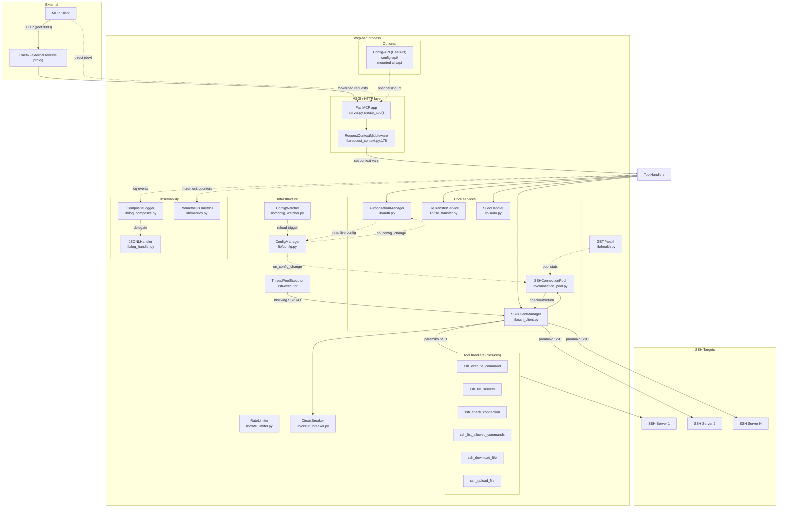
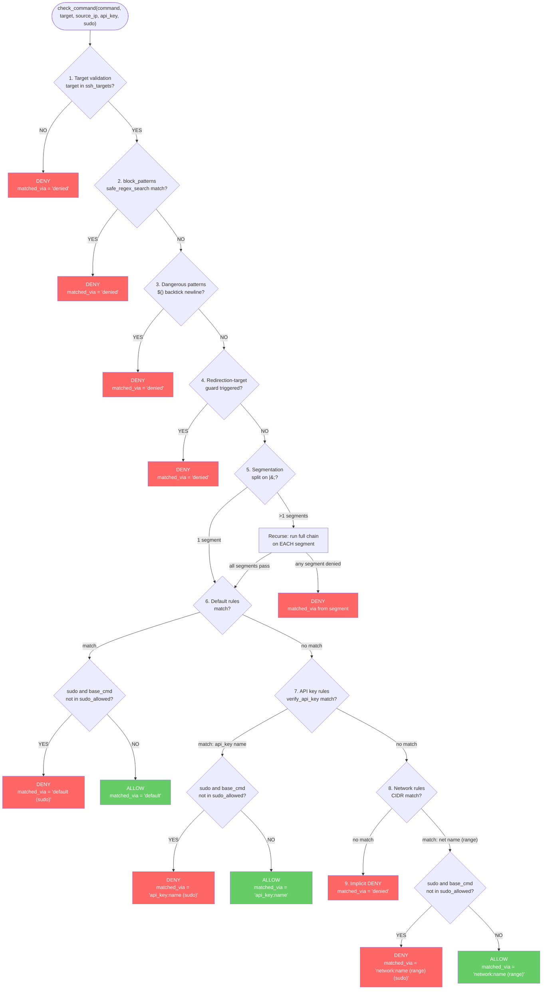
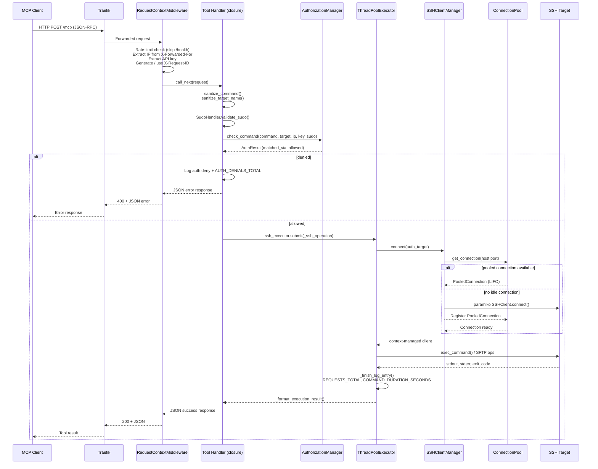
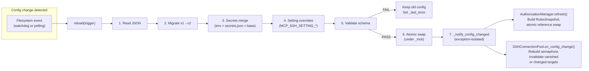
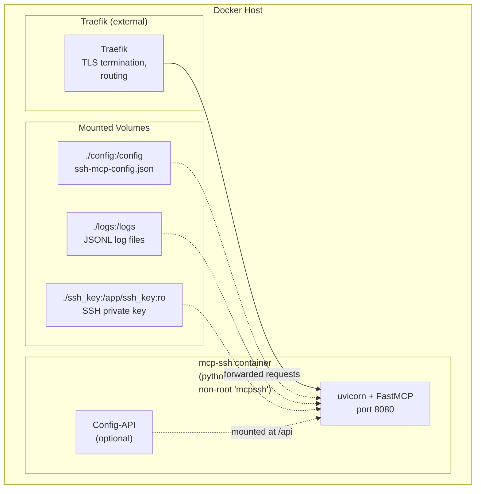

# Architecture

> High-level architecture, component relationships, data flow, and design
> rationale for **mcp-ssh** — an MCP server exposing SSH command execution
> and SFTP file transfer as MCP tools over streamable HTTP.

For security policy, threat model, and hardening guidelines, see
[docs/SECURITY.md](docs/SECURITY.md). For user-facing docs and tool
descriptions, see [README.md](README.md).

---

## 1. Overview

**mcp-ssh** is a [Model Context Protocol](https://modelcontextprotocol.io/)
server that exposes six SSH/SFTP tools via streamable HTTP on **port 8080**
at the `/mcp` path. It is designed to run as a Docker container behind a
reverse proxy (Traefik), serving a single-process, single-event-loop
architecture with blocking SSH I/O offloaded to a dedicated thread pool.

**Stack:**

| Layer | Technology |
|-------|-----------|
| Language | Python 3.13 |
| MCP framework | [FastMCP](https://gofastmcp.com/) 3.4.x |
| SSH client | [paramiko](https://www.paramiko.org/) 5.0 |
| ASGI runtime | Starlette 1.4 + uvicorn |
| Metrics | prometheus_client |
| Logging | Structured JSONL with rotation/gzip |
| Config hot-reload | watchdog (preferred) / polling fallback |

**Key design principles:**

- **App-factory pattern** — [`create_app()`](server.py:285) performs all
  I/O, thread spawning, and wiring; importing `server` has zero side effects.
- **Closure-based dependency injection** — tool handlers capture their
  dependencies from [`_register_tools()`](server.py:631) parameters; no
  module-level globals.
- **Immutable snapshots** — authorization rules live in a frozen
  [`RulesSnapshot`](lib/auth.py:180); updates swap the reference atomically,
  enabling lock-free reads.
- **Layered authorization** — a strict ordered chain (target → block →
  dangerous → redirect → segmentation → default → API key → network → deny)
  evaluated in [`AuthorizationManager.check_command()`](lib/auth.py:209).

---

## 2. Component Diagram

The diagram below shows the major runtime components and their relationships.
Traefik is an external reverse proxy (not managed in this repository).

---

## 3. Authorization Decision Tree

Authorization is evaluated by
[`AuthorizationManager.check_command()`](lib/auth.py:209) through a strict
ordered chain. Every layer runs against **each segment** of a piped/chained
command. The result carries a `matched_via` string that records which layer
made the decision (see [`AuthResult`](lib/auth.py)).

**Layer details:**

| # | Layer | Source | Description |
|---|-------|--------|-------------|
| 1 | Target validation | [`lib/auth.py:238`](lib/auth.py:238) | Reject unknown target IDs |
| 2 | Block patterns | [`lib/auth.py:244`](lib/auth.py:244) | ReDoS-safe regex via [`safe_regex_search()`](lib/redos_protection.py) |
| 3 | Dangerous patterns | [`lib/auth.py:249`](lib/auth.py:249) | `$()`, backticks, newlines ([`lib/command_security.py:42`](lib/command_security.py:42)) |
| 4 | Redirection guard | [`lib/auth.py:254`](lib/auth.py:254) | Output redirections into protected pseudofilesystem paths |
| 5 | Segmentation | [`lib/auth.py:259`](lib/auth.py:259) | [`strip_redirects()`](lib/command_security.py) → [`split_command_segments()`](lib/command_security.py:70) (split on `\|&;`); each segment runs the full chain recursively |
| 6 | Default rules | [`lib/auth.py:276`](lib/auth.py:276) | Default allow/deny rules matching any client |
| 7 | API key rules | [`lib/auth.py:310`](lib/auth.py:310) | [`_match_api_key()`](lib/auth.py) verifies via [`verify_api_key()`](lib/crypto.py) against stored `key_hash` |
| 8 | Network rules | [`lib/auth.py:353`](lib/auth.py:353) | [`_match_network()`](lib/auth.py) checks client IP against CIDR ranges |
| 9 | Implicit deny | [`lib/auth.py:396`](lib/auth.py:396) | Fallback when no rule matches |

---

## 4. Request Data Flow

A single MCP JSON-RPC request traverses the following path. The sequence
diagram shows the `ssh_execute_command` tool as a representative example; all
six tools follow the same middleware → sanitize → authorize → execute pattern.

**Key flow details:**

1. **[`RequestContextMiddleware.dispatch()`](lib/request_context.py:226)** —
   runs before every request:
   - Rate-limit check (sliding-window, per-IP) — returns `429` with
     `Retry-After` header on violation; `/health` is exempt.
   - Trusted-proxy-aware `X-Forwarded-For` extraction — only honored when
     the direct peer is in the configured `trusted_proxies` list.
   - API key extraction from `X-API-Key` header or `Authorization: Bearer`
     header.
   - Request ID from `X-Request-ID` header or freshly generated UUID.

2. **Tool handler** (e.g. [`ssh_execute_command`](server.py:1053)):
   - [`sanitize_command()`](lib/sanitize.py) / [`sanitize_target_name()`](lib/sanitize.py)
     — input sanitization before any validation.
   - [`SudoHandler.validate_sudo()`](lib/sudo.py) — reject raw `sudo` in command.
   - [`_authorize_command()`](server.py:735) — calls
     [`AuthorizationManager.check_command()`](lib/auth.py:209); on deny
     logs `auth.deny` and increments `AUTH_DENIALS_TOTAL`.

3. **Execution path** (allow):
   - [`ssh_executor.submit(_ssh_operation).result()`](server.py:1207) —
     blocking SSH I/O runs on the dedicated `ThreadPoolExecutor`
     (thread prefix `ssh-executor`), keeping the uvicorn event loop free.
   - [`SSHClientManager.connect()`](lib/ssh_client.py) — circuit breaker
     check → retry with exponential backoff → connection pool checkout.
   - [`SSHConnectionPool.get_connection()`](lib/connection_pool.py:240) —
     LIFO idle checkout, health-check, or fresh creation; global semaphore
     enforces `max_concurrent_ssh_connections`.

4. **Response** —
   [`_format_execution_result()`](server.py) builds combined stdout/stderr;
   [`_format_error()`](server.py) wraps exceptions as JSON with safe user
   messages. Exceptions never escape tool handlers.

---

## 5. Config Hot-Reload

Configuration is managed by [`ConfigManager`](lib/config.py:1) which supports
live reloading without restarting the server.

### Watcher startup

[`ConfigManager.start_watcher()`](lib/config.py:656) is called once during
[`create_app()`](server.py:334). It prefers a **watchdog Observer**
(event-driven filesystem notifications) and falls back to a **polling daemon
thread** that checks `os.path.getmtime()` every
`settings.watcher_debounce_seconds` (default from
[`DEFAULT_WATCHER_INTERVAL_SECONDS`](lib/constants.py)).

### Reload pipeline

On every detected change, [`ConfigManager.reload()`](lib/config.py:270)
executes:

1. **Re-read** — read and parse the JSON config file.
2. **Migrate** — apply v1→v2 schema migration via
   [`migrate_config()`](lib/config_migration.py) if needed.
3. **Secrets merge** — [`SecretsManager.merge()`](lib/secrets.py) overlays
   environment variables (`MCP_SSH_SECRET_*`) and `secrets.json` entries
   onto the base config. Priority: env vars > secrets.json > base config.
4. **Setting overrides** — apply `MCP_SSH_SETTING_*` env vars.
5. **Validate** — strict schema and business-rule validation.
6. **Atomic swap** — under `self._lock`, replace `self._data` with the
   validated config and update the O(1) target name index.
7. **Notify** — [`_notify_config_changed()`](lib/config.py:426) invokes all
   registered callbacks with **per-callback error isolation** (exceptions are
   logged and swallowed — one failing callback never affects others).

On **failure** at any step, the existing config is preserved and
`_last_error` is updated.

### Consumer reactions

- **[`AuthorizationManager.refresh()`](lib/auth.py:203)** — rebuilds the
  immutable [`RulesSnapshot`](lib/auth.py:200) and atomically swaps the
  `_rules` reference. Lock-free reads continue unconditionally.
- **[`SSHConnectionPool.on_config_change()`](lib/connection_pool.py:166)** —
  rebuilds the global semaphore if `max_concurrent_ssh_connections` changed,
  closes connections for removed or reconfigured targets (keyed by
  `host:port#auth_digest`), and re-registers updated targets.
- **Trusted-proxies provider** — [`RequestContextMiddleware`](lib/request_context.py:214)
  re-reads the live trusted-proxy list per request via a provider callback.

---

## 6. Thread Safety

mcp-ssh runs a single uvicorn event loop with blocking SSH I/O offloaded to
a thread pool. Thread safety is achieved through several complementary
strategies:

### Immutable snapshots + atomic reference swap

- **AuthorizationManager** — authorization state lives in a frozen
  [`RulesSnapshot`](lib/auth.py:180) (a dataclass-like frozen object). Updates
  build a fresh snapshot and atomically swap the single `self._rules`
  reference ([`lib/auth.py:200`](lib/auth.py:200)). Concurrent readers
  observe a complete, consistent rule set — no partial updates, no locks
  needed for reads.

### ConfigManager locks

- **`_lock`** — guards `_data` (the live config dict). The public `data`
  property returns a **shallow copy** under the lock, so callers get a
  consistent snapshot without holding the lock during processing.
- **`_callbacks_lock`** — guards the list of registered callbacks (read
  under lock, iterate outside lock for isolation).

### ThreadPoolExecutor

- **`ssh-executor`** — a dedicated
  [`ThreadPoolExecutor`](server.py:486) (prefix `ssh-executor`) handles all
  blocking SSH I/O. Tool handlers submit work via
  `ssh_executor.submit(fn).result()`, keeping the async event loop free.

### SSHConnectionPool

- **Per-target locks** — each target has its own `threading.Lock` in the
  `_locks` map ([`lib/connection_pool.py:124`](lib/connection_pool.py:124)).
  These are **never nested** — each operation acquires at most one target
  lock.
- **`_locks_guard`** — a separate lock protects the `_locks` map itself
  (double-checked in `_lock_for`).
- **Global semaphore** — [`threading.Semaphore`](lib/connection_pool.py:116)
  enforces `max_concurrent_ssh_connections` across all targets. Acquired
  non-blocking; raises `ServiceUnavailableError` (HTTP 503) when exhausted.
- **Idle-eviction daemon** — a background thread periodically sweeps
  idle connections.

### CircuitBreaker

- **Single lock** — all state mutations happen under one
  `threading.Lock` ([`lib/circuit_breaker.py:56`](lib/circuit_breaker.py:56)).
  States: `CLOSED` → `OPEN` → `HALF_OPEN` with a single in-flight probe.

### RateLimiter

- **Sliding-window deque under lock** — per-IP timestamp deques stored in a
  `dict[str, deque[float]]`, all guarded by a single `threading.Lock`
  ([`lib/rate_limiter.py:58`](lib/rate_limiter.py:58)).

### Log sinks

- **Per-sink serialization** — [`CompositeLogger`](lib/log_composite.py:37)
  holds a lock per `log()` call; individual targets
  (`JsonFileLogger`, `TextFileLogger`, `StdoutLogger`) serialize writes
  under their own per-sink locks.

### Graceful shutdown

Shutdown order (resources released leaf-first):

1. **Drain executor** — bounded wait (`ssh_executor.shutdown(wait=True,
   cancel_futures=True)`) with a configurable timeout; force-cancel on
   timeout.
2. **Stop config watcher** — signal the polling thread or stop the watchdog
   observer.
3. **Stop connection pool** — close idle and active SSH connections.
4. **Close log sinks** — flush and close all log targets.

This ensures nothing may log, connect, or reload after its dependencies are
gone.

---

## 7. File Organization

The [`lib/`](lib/) directory contains 25 focused modules. All magic values
live in [`lib/constants.py`](lib/constants.py); all exceptions derive from
[`MCPSSHError`](lib/exceptions.py:17); public symbols are re-exported via
[`lib/__init__.py`](lib/__init__.py).

| Module | Responsibility |
|--------|---------------|
| [`server.py`](server.py) | App factory (`create_app()`), tool handlers, CLI entry point, graceful shutdown |
| [`lib/config.py`](lib/config.py) | `ConfigManager` — load, validate, hot-reload, setting overrides |
| [`lib/config_migration.py`](lib/config_migration.py) | Schema migration (v1→v2), backup, write-back |
| [`lib/config_watcher.py`](lib/config_watcher.py) | Watchdog `FileChangeHandler` for config filesystem events |
| [`lib/secrets.py`](lib/secrets.py) | `SecretsManager` — merge `secrets.json` + `MCP_SSH_SECRET_*` env vars |
| [`lib/auth.py`](lib/auth.py) | `AuthorizationManager` — layered auth chain, immutable `RulesSnapshot` |
| [`lib/command_security.py`](lib/command_security.py) | Dangerous pattern detection, command segmentation, redirect stripping |
| [`lib/sanitize.py`](lib/sanitize.py) | Input sanitization for commands, target names, log strings |
| [`lib/sudo.py`](lib/sudo.py) | `SudoHandler` — validate, wrap sudo command, password injection |
| [`lib/redos_protection.py`](lib/redos_protection.py) | Safe regex compilation and ReDoS-resistant matching |
| [`lib/crypto.py`](lib/crypto.py) | PBKDF2-HMAC-SHA256 API-key hashing and constant-time verify |
| [`lib/ssh_client.py`](lib/ssh_client.py) | `SSHClientManager` — connect, retry, circuit-break, key loading |
| [`lib/connection_pool.py`](lib/connection_pool.py) | `SSHConnectionPool` — per-target pooling, idle eviction, concurrency cap |
| [`lib/circuit_breaker.py`](lib/circuit_breaker.py) | Per-target `CircuitBreaker` — CLOSED/OPEN/HALF_OPEN state machine |
| [`lib/ssh_operations.py`](lib/ssh_operations.py) | Standalone SSH functions (check, connect, execute) |
| [`lib/file_transfer.py`](lib/file_transfer.py) | `FileTransferService` — SFTP upload/download with 7-layer path validation |
| [`lib/request_context.py`](lib/request_context.py) | `RequestContextMiddleware` — IP, API key, request ID, rate limiting |
| [`lib/rate_limiter.py`](lib/rate_limiter.py) | `RateLimiter` — sliding-window per-IP rate limiting |
| [`lib/health.py`](lib/health.py) | `GET /health` endpoint (pool stats, config status) |
| [`lib/metrics.py`](lib/metrics.py) | Prometheus counters/histograms + `GET /metrics` endpoint |
| [`lib/constants.py`](lib/constants.py) | All magic numbers, defaults, and string constants (single source of truth) |
| [`lib/types.py`](lib/types.py) | `TypedDict` models for tool return values |
| [`lib/exceptions.py`](lib/exceptions.py) | `MCPSSHError` exception hierarchy |
| [`lib/log_composite.py`](lib/log_composite.py) | `CompositeLogger` — fan-out to multiple log targets |
| [`lib/log_manager.py`](lib/log_manager.py) | `LoggingManager` — build log targets from config |
| [`lib/log_handler.py`](lib/log_handler.py) | `JSONLHandler` — bridge stdlib logging to structured JSONL |
| [`lib/log_target_jsonfile.py`](lib/log_target_jsonfile.py) | `JsonFileLogger` — JSONL file output with rotation/gzip |
| [`lib/log_target_textfile.py`](lib/log_target_textfile.py) | `TextFileLogger` — plain-text file output |
| [`lib/log_target_stdout.py`](lib/log_target_stdout.py) | `StdoutLogger` — JSONL to stdout |
| [`lib/size_utils.py`](lib/size_utils.py) | `parse_size_bytes()` for human-readable size strings |

---

## 8. Deployment View

**Container details:**

| Aspect | Detail |
|--------|--------|
| Base image | `python:3.13-alpine` (SHA256 hash-pinned) |
| User | Non-root `mcpssh` (created at build time) |
| Entrypoint | `python3 /app/server.py --config /config --ssh-key ssh_key --log-dir /logs` |
| Port | 8080 (EXPOSE) |
| Healthcheck | `wget --spider http://localhost:8080/health` (30s interval, 10s timeout) |

**HTTP endpoints:**

| Endpoint | Purpose | Auth |
|----------|---------|------|
| `POST /mcp` | MCP streamable HTTP transport (all 6 tools) | Rate-limited; IP + API key context |
| `GET /health` | Health check + pool statistics | Exempt from rate limiting |
| `GET /metrics` | Prometheus metrics (text) | — |
| `GET /api/*` | Config-API (optional, `CONFIG_API_ENABLED=true`) | Token/session auth |

**Volume mounts:**

| Container path | Host path | Mode | Purpose |
|---------------|-----------|------|---------|
| `/config` | `./config` | rw | Config file, secrets file |
| `/logs` | `./logs` | rw | JSONL log files |
| `/app/ssh_key` | `./ssh_key` | ro | Default SSH private key |

---

## Appendix: Tool Summary

| Tool | Read-only | Description |
|------|-----------|-------------|
| `ssh_list_servers` | Yes | List configured SSH targets |
| `ssh_list_allowed_commands` | Yes | List commands allowed for caller + target |
| `ssh_check_connection` | Yes | Verify SSH connectivity to a target |
| `ssh_execute_command` | No | Execute a command on a remote server |
| `ssh_download_file` | Yes | SFTP download from remote to local |
| `ssh_upload_file` | No | SFTP upload from local to remote |
