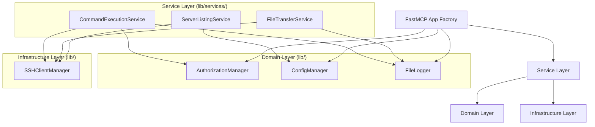

# 01 - Clean Architecture

## Current State Analysis

### Module Dependency Graph
```
server.py (entry point)
  ├── lib/config.py         (ConfigManager)
  ├── lib/auth.py           (AuthorizationManager)
  ├── lib/loggers.py        (BaseLogger, FileLogger)
  ├── lib/health.py         (attach_health_endpoint)
  ├── lib/request_context.py (RequestContextMiddleware, get_current_request)
  ├── fastmcp (external)
  └── paramiko (external)
```

### Layer Assessment

**Current Layers:**
1. Transport/HTTP Layer: Starlette/ASGI (via FastMCP) — in [`server.py`](server.py:1)
2. Application Layer: FastMCP tools, middleware — in [`server.py`](server.py:1)
3. Domain Layer: Config, Auth, Logging — in [`lib/`](lib/__init__.py:1)
4. Infrastructure Layer: SSH via Paramiko, File I/O — scattered across [`server.py`](server.py:1)

### Architectural Issues Identified

1. **SSH Client Creation Lives in server.py**
   - [`get_ssh_client()`](server.py:152) creates Paramiko clients directly in the application layer. This infrastructure concern should be in a dedicated SSH client factory or repository module.
   - SSH key loading, socket setup, and connection logic are coupled to tool definitions.

2. **File Transfer Logic is Inline**
   - [`ssh_download_file()`](server.py:252) and [`ssh_upload_file()`](server.py:298) contain raw SFTP operations directly in MCP tool handlers.
   - Path restriction validation is duplicated across both functions.

3. **Middleware Registration is Implicit**
   - [`RequestContextMiddleware`](lib/request_context.py:12) is added via `server.add_middleware()` at module level, making middleware ordering implicit.
   - The health endpoint uses `mcp.custom_route` which bypasses middleware — this inconsistency isn't documented.

4. **FastMCP Global Instance**
   - `mcp = FastMCP("mcp-ssh")` at module level in [`server.py`](server.py:48) couples the entire application to a global. Testing requires monkeypatching.

5. **No Dependency Injection**
   - Tools access `config_manager`, `auth_manager`, and `logger` as globals rather than through injection.
   - Hard to swap implementations for testing (current tests simulate logic rather than importing the module).

### Dependency Direction Analysis

```
server.py ──depends on──> lib/config.py  ✓ correct
server.py ──depends on──> lib/auth.py    ✓ correct
server.py ──depends on──> lib/loggers.py ✓ correct
server.py ──depends on──> paramiko       ⚠ infrastructure in app layer
lib/auth.py ──depends on──> (nothing)    ✓ pure domain logic
lib/config.py ──depends on──> (stdlib)   ✓ pure domain logic
lib/loggers.py ──depends on──> (stdlib)  ✓ pure domain logic
```

No circular dependencies exist. The main issue is infrastructure concerns (Paramiko) leaking into the application layer.

### Recommendations

1. **Extract `SSHClientManager` class**
   - Move [`get_ssh_client()`](server.py:152) into `lib/ssh_client.py`
   - Encapsulate key loading, connection, and error handling
   - Provide a factory interface for testability

2. **Extract `FileTransferService` class**
   - Move SFTP logic from [`ssh_download_file()`](server.py:252) and [`ssh_upload_file()`](server.py:298) into `lib/file_transfer.py`
   - Centralize path restriction/validation logic
   - Add `download_bytes()` and `upload_bytes()` interface methods

3. **Introduce Application Factory Pattern**
   - Wrap FastMCP creation in a factory function: `create_app(config_path, log_dir) -> FastMCP`
   - Accept dependencies as constructor arguments rather than globals
   - Return configured app instance for testing

4. **Add Service Layer**
   - Create `lib/services/` package
   - `CommandExecutionService` — wraps SSH exec with authorization + logging
   - `FileTransferService` — wraps SFTP with path validation + logging
   - `ServerListingService` — wraps SSH target enumeration

5. **Explicit Middleware Pipeline**
   - Document middleware ordering in code
   - Make health endpoint middleware-aware or explicitly document the bypass

6. **Interface/Protocol Definitions**
   - Define `LoggerProtocol`, `ConfigProtocol`, `AuthProtocol` as ABCs or Protocols
   - Enable dependency inversion for testing

## Target Architecture



## Acceptance Criteria
- No Paramiko imports in `server.py` except through infrastructure layer
- All tools call service layer methods, not infrastructure directly
- Dependencies injectable via constructor or factory function
- Interfaces defined as Protocols/ABCs for testability
- Middleware pipeline explicitly documented
