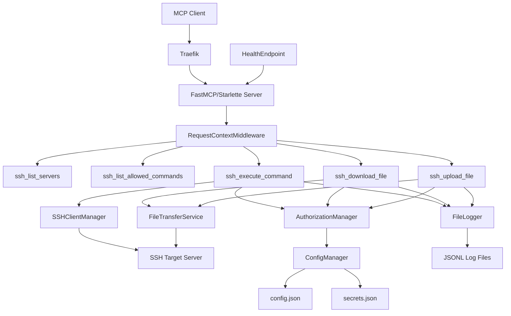
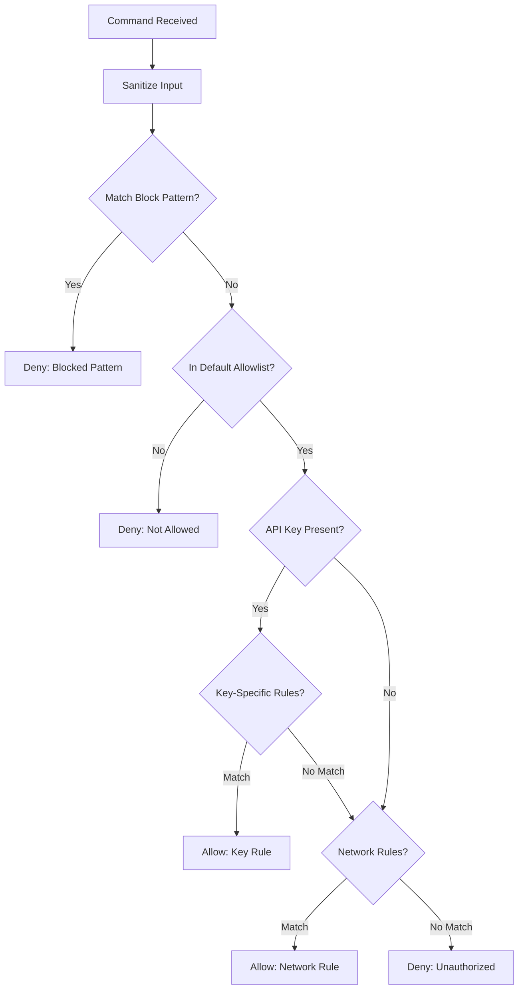

# 15a - Create README, ARCHITECTURE, SECURITY & CONTRIBUTING Docs

**Parent Plan**: [15-documentation-inline-comments.md](plans/15-documentation-inline-comments.md)

## Objective
Create the four core project documentation files: `README.md`, `ARCHITECTURE.md`, `SECURITY.md`, and `CONTRIBUTING.md`. These are the foundation documents visitors and contributors need.

## Implementation Steps

### 1. Create `README.md`
Document structure:

```markdown
# mcp-ssh

FastMCP-based SSH server providing MCP tools for remote command execution,
file transfer, and server management with layered authorization.

## Features
- **5 MCP Tools**: `ssh_list_servers`, `ssh_list_allowed_commands`,
  `ssh_execute_command`, `ssh_download_file`, `ssh_upload_file`
- **Layered Authorization**: block patterns → default allowlist → API key rules → network rules → deny
- **Structured Logging**: JSONL format with size-based rotation
- **Hot-Reload Configuration**: Config changes detected and applied without restart
- **Docker Deployment**: Docker Compose with Traefik reverse proxy integration
- **SFTP File Transfer**: Secure upload/download with path restriction
- **Sudo Support**: Transparent sudo wrapping with password handling

## Quick Start

### Prerequisites
- Docker and Docker Compose
- SSH access to target servers
- SSH key pair

### Setup
1. Clone the repository
2. Copy `default-config.json` to `config.json` and edit:
   - Add your SSH targets
   - Configure allowed commands
   - Set API keys
3. Place your SSH private key as `ssh_key` in the project directory
4. Start the service:
   ```bash
   docker compose up -d
   ```
5. The MCP endpoint is available at `https://your-host/mcp-ssh`

## Configuration

See `default-config.json` for a complete example with inline documentation.
Key sections:
- `version`: Config schema version (currently 1)
- `ssh_targets`: List of SSH servers with host, port, auth, and sudo settings
- `block_patterns`: Regex patterns for commands that are always denied
- `allowed_commands`: Per-API-key and per-network command allowlists
- `api_keys`: SHA-256 hashed API keys with labels
- `settings`: Operational settings (timeouts, log paths, output limits)

## Security

⚠️ **Important**: This service executes arbitrary commands on remote servers.
- Always use TLS termination (Traefik reverse proxy configured by default)
- Restrict API keys and follow least-privilege principle
- Use `block_patterns` to deny dangerous commands globally
- See [SECURITY.md](SECURITY.md) for full security model

## API Reference

### Tools

| Tool | Description |
|------|-------------|
| `ssh_list_servers` | List all configured SSH targets |
| `ssh_list_allowed_commands` | List commands allowed for the authenticated caller |
| `ssh_execute_command` | Execute a command on a target server |
| `ssh_download_file` | Download a file from a target server via SFTP |
| `ssh_upload_file` | Upload a file to a target server via SFTP |

See [ARCHITECTURE.md](ARCHITECTURE.md) for request/response formats and examples.

## License

MIT — see [LICENSE](LICENSE)
```

### 2. Create `ARCHITECTURE.md`
Must include:

- **Component Diagram** (Mermaid):


- **Authorization Decision Tree** (Mermaid flowchart):


- **Data Flow**: MCP JSON-RPC request → middleware extracts IP/API key → tool handler resolves target → auth check → SSH connection → execution → response
- **Config Hot-Reload**: Watcher thread polls mtime → validates → atomically swaps config → notifies auth manager
- **Thread Safety**: ConfigManager uses `threading.Lock` for writes, atomic reference swap for reads. FileLogger serializes writes.
- **File Organization Rationale**: Why `lib/` modules are separated the way they are

### 3. Create `SECURITY.md`
```markdown
# Security Policy

## Security Model

mcp-ssh is a bridge between MCP clients and SSH servers. It is designed to
be deployed behind a TLS-terminating reverse proxy (Traefik by default).

### Trust Boundaries
1. **External → MCP Server**: Authenticated via API key in HTTP header
2. **MCP Server → SSH Target**: Authenticated via SSH key or password
3. **Config File**: Must be readable only by the MCP server process (mode 0600)

### Authorization Chain
Refer to ARCHITECTURE.md for the full decision tree.

## TLS Requirement
This service MUST be deployed behind TLS termination. The default Docker Compose
configuration includes Traefik with automatic TLS. Never expose the FastMCP
port directly to untrusted networks.

## API Key Management
- API keys are stored as SHA-256 hashes (prefixed with `sha256:`)
- Generate keys with sufficient entropy (≥128 bits)
- Rotate keys regularly
- Use per-client keys with least-privilege command allowlists
- Never store raw API keys in version control

## SSH Key Security
- Use Ed25519 keys when possible
- Protect SSH private keys with file permissions (mode 0600)
- Consider using SSH agent forwarding instead of key files
- Use separate SSH keys for the MCP server (not personal keys)

## Reporting a Vulnerability
[Add reporting process — email, issue tracker policy, PGP key if applicable]

## Security-Relevant Configuration
- `block_patterns`: Always-configure deny rules for dangerous commands
  (rm -rf, shutdown, reboot, etc.)
- `max_command_output`: Prevents memory exhaustion from large outputs
- `command_timeout_seconds`: Prevents hung commands from blocking resources
- `sudo_allowed`: Per-target sudo control
```

### 4. Create `CONTRIBUTING.md`
```markdown
# Contributing

## Development Setup
1. Clone repo
2. Create virtual environment: `python -m venv .venv && source .venv/bin/activate`
3. Install dependencies: `pip install -r requirements.txt`
4. Install dev dependencies: `pip install pytest pytest-cov`
5. Run tests: `pytest`

## Running Tests
- Unit tests: `pytest tests/`
- Integration tests: `pytest tests/integration/`
- With coverage: `pytest --cov=lib --cov=server`

## Code Style
- Follow PEP 8 (see `.editorconfig`)
- Max line length: 100 characters
- Snake case for functions/variables, PascalCase for classes
- Google-style docstrings for public functions
- Type hints required for all public API

## Pull Request Process
1. Create a feature branch
2. Add tests for new functionality
3. Ensure all tests pass
4. Update documentation if needed
5. Submit PR with description of changes

## Adding New Tools
1. Define the tool function in `server.py` following existing patterns
2. Add authorization rules if needed
3. Add unit and integration tests
4. Document in README.md API Reference
5. Update ARCHITECTURE.md diagrams if adding new flows
```

## Dependencies
- None (documentation can be created independently)

## Acceptance Criteria
- `README.md` with project overview, quick start, config guide, security note, API reference table
- `ARCHITECTURE.md` with Mermaid component diagram, authorization flowchart, data flow, thread safety explanation
- `SECURITY.md` with trust boundaries, TLS requirement, API key guidance, vulnerability reporting
- `CONTRIBUTING.md` with dev setup, test instructions, code style, PR process, new tool guide
