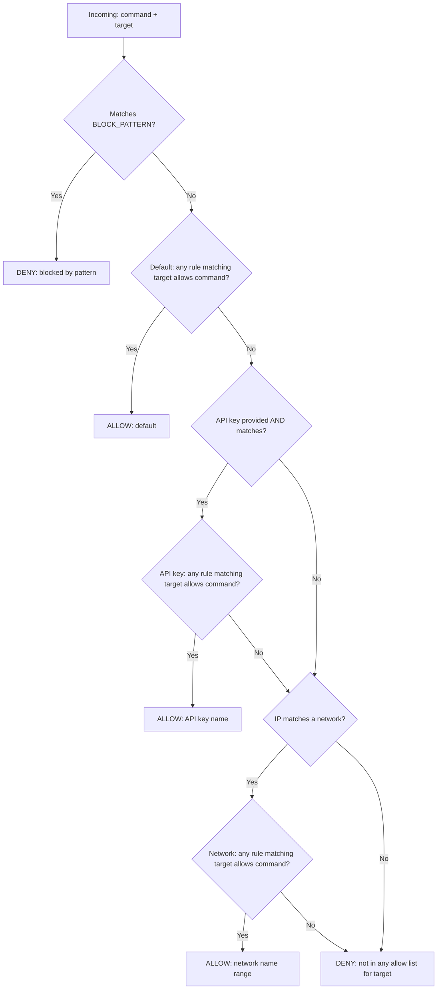
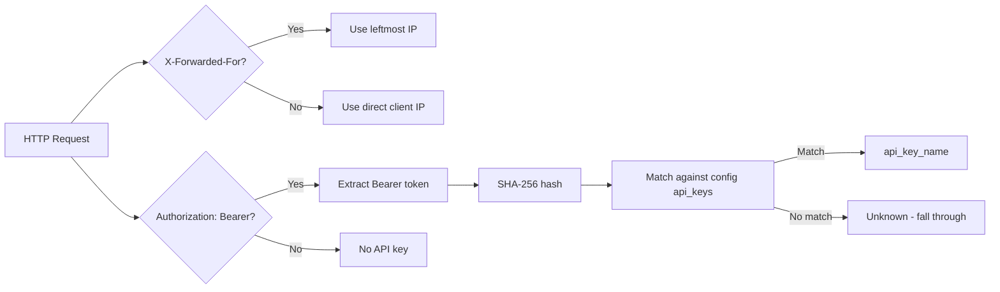

# SSH MCP Server — Refactoring Plan Overview

## Architecture

```
                        ┌──────────────────────────────┐
                        │        server.py              │
                        │  (FastMCP entry point,        │
                        │   tool handlers, CLI)         │
                        └──────────┬───────────────────┘
                                   │ depends on
           ┌───────────────────────┼───────────────────────┐
           │                       │                       │
┌──────────▼──────────┐ ┌─────────▼─────────┐ ┌──────────▼──────────┐
│   lib/config.py     │ │   lib/auth.py     │ │  lib/loggers.py     │
│   ConfigManager     │ │ AuthorizationMgr  │ │  BaseLogger (ABC)   │
│                     │ │                   │ │  FileLogger         │
│ - load/validate     │ │ - check_command() │ │                     │
│ - hot-reload(poll)  │ │ - list_allowed()  │ │ - JSONL output      │
│ - default creation  │ │ - AuthResult      │ │ - rotation          │
│ - ssh_targets       │ │ - per-target auth │ │                     │
└─────────────────────┘ └───────────────────┘ └─────────────────────┘
           │                       │
           ▼                       ▼
┌──────────────────────┐  ┌────────────────────────┐
│ default-config.json  │  │ /config/                │
│ (bundled in package) │  │   ssh-mcp-config.json   │
└──────────────────────┘  │ (user-maintained)       │
                          └────────────────────────┘
```

## Key Changes from Current Codebase

| Current | New |
|---------|-----|
| `ssh-servers.json` (separate file) | `ssh_targets` section in unified [`ssh-mcp-config.json`](config/ssh-mcp-config.json) |
| Hardcoded `ALLOWED_COMMANDS` in [`server.py`](server.py:20) | `allowed_commands.default` in config |
| Hardcoded `BLOCK_PATTERNS` in [`server.py`](server.py:37) | `block_patterns` in config |
| One-size-fits-all permissions | Layered: default + API key + IP range, per-target rules |
| No logging | Structured JSONL logging via pluggable backends |
| `image:` in compose (no build) | `build:` referencing Dockerfile |
| Secrets copied into image | Secrets mounted at runtime |
| No healthcheck | HEALTHCHECK + `/health` endpoint |

## Plan Files

| # | File | Topic | Dependencies |
|---|------|-------|--------------|
| 1 | [`plans/01-docker-compose.md`](plans/01-docker-compose.md) | Docker & Compose best practices | References final file structure from plans 02-04 |
| 2 | [`plans/02-config-file.md`](plans/02-config-file.md) | Unified config file with watching, SSH targets, validation | Foundation for plans 03, 04, and 05 |
| 3 | [`plans/03-layered-authorization.md`](plans/03-layered-authorization.md) | Layered authorization (default, API key, IP) with per-target rules | Depends on plan 02 (ConfigManager) |
| 4 | [`plans/04-logging.md`](plans/04-logging.md) | Structured logging | Depends on plan 02 (log dir config), integrates with plan 03 (auth results) |
| 5 | [`plans/05-sudo-support.md`](plans/05-sudo-support.md) | Sudo support via optional flag (summary) | Depends on plan 02 (password for sudo), plan 03 (auth chain) |

## Target File Structure After Implementation

```
mcp-ssh/
├── Dockerfile                    # MODIFIED: non-root user, healthcheck, no secrets
├── .dockerignore                 # NEW
├── compose.yaml                  # MODIFIED: build: directive, volume mounts
├── server.py                     # MODIFIED: modularized, uses lib/, argparse
├── ssh_key                       # (existing, now mounted at runtime)
├── ssh_key.pub                   # (existing, now mounted at runtime)
├── ssh-servers.json              # REMOVED (merged into unified config)
├── default-config.json           # NEW (bundled default config for first-run)
├── lib/                          # NEW PACKAGE
│   ├── __init__.py
│   ├── config.py                 # ConfigManager (unified config: targets + auth + settings)
│   ├── auth.py                   # AuthorizationManager, AuthResult
│   ├── loggers.py                # BaseLogger (ABC), FileLogger
│   └── health.py                 # Health check endpoint
├── tests/                        # NEW
│   ├── __init__.py
│   ├── test_config.py
│   ├── test_auth.py
│   └── test_loggers.py
├── config/                       # (runtime, mounted volume)
│   └── ssh-mcp-config.json       # (auto-created on first run from default-config.json)
├── logs/                         # (runtime, mounted volume)
│   └── ssh-mcp.log
└── plans/                        # (these plan files)
    ├── README.md                 # (this file)
    ├── 01-docker-compose.md
    ├── 02-config-file.md
    ├── 03-layered-authorization.md
    └── 04-logging.md
```

## Implementation Order (Recommended)

1. **Plan 02** first — establishes `lib/config.py` and unified config file (SSH targets + auth rules + settings)
2. **Plan 04** second — establishes `lib/loggers.py` so it's available for plan 03 integration
3. **Plan 03** third — builds `lib/auth.py` on top of config, integrates logging
4. **Plan 05** fourth — sudo support (adds `sudo` flag to exec, `\bsudo\b` to block_patterns)
5. **Plan 01** last — Docker/compose changes that reference the final file structure

## Unified Config Schema (Summary)

```
ssh-mcp-config.json
├── version: 1
├── ssh_targets: { "<id>": { host, port?, username, private_key?, password? } }
├── block_patterns: [ regex, ... ]
├── allowed_commands:
│   ├── default: [ { targets: [...], commands: [...] }, ... ]
│   ├── api_keys: [ { name, key_hash, rules: [ { targets, commands }, ... ] }, ... ]
│   └── networks: [ { name, range, rules: [ { targets, commands }, ... ] }, ... ]
└── settings: { max_output_length, command_timeout_max }
```

Each rule object has:
- `targets`: list of SSH target IDs or `["*"]` — which targets this rule applies to
- `commands`: list of command names or `["*"]` — which commands are allowed

Validation enforces:
- SSH target must have at least one of `private_key` or `password`
- Target IDs referenced in rules must exist in `ssh_targets` (or be `"*"`)
- CIDR ranges must be valid
- Regex patterns must be compilable
- `key_hash` must match `sha256:<64-char-hex>` format
- On hot-reload validation failure: keep old config, log error

## Authorization Flow (Per-Target)



## Client Identity Extraction



## Key Design Decisions

| Decision | Rationale |
|----------|-----------|
| Unified config (replaces ssh-servers.json) | Single source of truth; simpler deployment |
| Config as JSON (not YAML) | User preference; avoids extra dependency |
| Polling for config reload (not inotify) | Simpler, no extra deps, works across all platforms |
| 15-second polling interval | User specified; config changes are infrequent |
| API key stored as `sha256:<hex>` hash | Raw keys never persisted; constant-time-ish comparison |
| `Authorization: Bearer <key>` header | Standard HTTP authentication pattern |
| Client IP from `X-Forwarded-For` with fallback | Standard practice behind reverse proxies (Traefik) |
| JSONL log format (one JSON per line) | Machine-parseable, easy to ingest into log aggregators |
| `BaseLogger` ABC with `FileLogger` impl | Strategy pattern enables future backends (syslog, Graylog) |
| Secrets mounted at runtime, not in image | Docker security best practice |
| Non-root user in container | Docker security best practice |
| Wildcard `"*"` in targets and commands | Clean way to express "applies to all" in rules |
| Per-target rule evaluation | Fine-grained: different targets can have different commands per client |
| Layer evaluation: block → default → api_key → network → deny | Predictable, debuggable, matches user's specified chain |
| Union semantics (layers add, never subtract) | Layers only extend permissions, never restrict below default |
| Validation failure → keep old config | Never crash on bad config; log error and continue |
| `ssh_list_allowed_commands` takes mandatory `server_name` | Commands are always target-specific |
